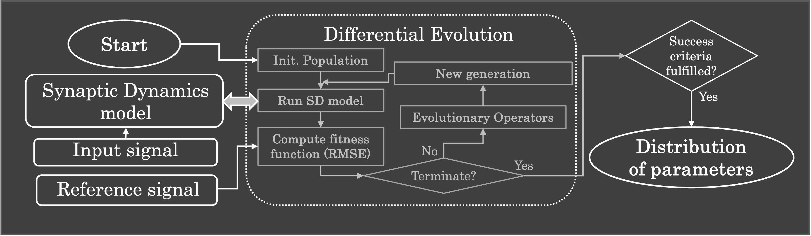

## Description
In this repository, a pipeline is presented to search for 
parameters of Synaptic Dynamics (SD) models, with the aim of simulating 
experimental _in vitro_ recordings of real synapses (Associated paper can be found [here](https://www.esann.org/sites/default/files/proceedings/2025/ES2025-111.pdf)). The pipeline have 
different components: an input signal, a reference signal, a SD model 
and an implementation of Differential Evolution (DE).
A diagram of the pipeline is depicted here:



### Input and reference signals
The input and reference signals are the information needed from the _in vitro_
experiments. They must have the same shape in order to run the pipeline.

### Synaptic Dynamics model
This repository implements three SD models: the Tsodyks-Markram (TM) model [[1]](http://www.scholarpedia.org/article/Short-term_synaptic_plasticity),
the Modified Stochastic Synaptic Model (MSSM) [[2]](https://ul.qucosa.de/landing-page/?tx_dlf[id]=https%3A%2F%2Ful.qucosa.de%2Fapi%2Fqucosa%253A11334%2Fmets),
and the Lee-Anton-Poon model (LAP) [[3]](https://link.springer.com/10.1007/s10827-008-0122-6).
All three models inherits from a superclass called SynDynModel, which can be 
considered as the template to implement other SD models.

### Differential Evolution 
De is a population optimization technique, part of the family of Evolutionary
Algorithms. The [_scikit-learn_](https://scikit-learn.org/stable/) implementation
of DE is used in this pipeline. For more information about that implementation,
please follow this [link](https://docs.scipy.org/doc/scipy/reference/generated/scipy.optimize.differential_evolution.html).

## How to use the pipeline
The class ```Fit_params_SD``` implements the pipeline, it requires five arguments:
1. ```input_signal```: A 1D numpy array with shape _N_, corresponding to the input 
signal of the _in vitro_ experiment.
2. ```reference_signal```: a 1D numpy array with shape _N_, corresponding to the
postsynaptic response of the _in vitro_ experiment, given the input_signal.
3. ```model_SD```: An object of type ```SynDynModel```, specifying one model of Synaptic
Dynamics. In this repository, three models are implemented for general purposes:
MSSM, TM and LAP models. Any other model can be implemented by inheriting from 
the superclass ```SynDynModel```.
4. ```dict_params```: a dictionary containing the following keys:  
   ```'model_str'```: A string defining a convention for the SD model. It is suggested
   to use an abbreviation of the model (e.g. 'MSSM', 'TM', or 'LAP').  
   ```'params_name'```: A list of strings, whose content is the name of the ```model_SD``` 
   _p_-parameters to be trained by the pipeline. The list must contain at least one 
   element. The names of the parameters can be accessed by retrieving the keys 
   of the dictionary ```'params'``` from the ```model_SD``` object (e.g. ```model_SD.params.key()```)  
   ```'bo'```: A tuple of two elements that specifies the boundaries of the search space 
   for DE. The first element must be a tuple with the minimum-limits of each _p_-parameter,
   and the second element must be a tuple with the maximum-limits. The length of each
   tuple (minimum- and maximum-limits) must be equal to _p_, the number of parameters
   to be tuned.  
   ```'ODE_mode'```: A String defining the type of ODE solver. For the moment, only the euler
    method is supported ('ODE' is the string corresponding to this method).     
   ```'ind_experiment'```: An integer value that corresponds to the index of the DE experiment.  
   ```'only_spikes'```: Boolean value that specifies if the postsynaptic response of the 
   ```model_SD``` should be all the time series (```False```), or it should be the postsynaptic
   response to the input spiking activity (```True```). The latter is specially useful if 
   the reference data is only the postsynaptic response to the input spike activity, 
   and not the complete time-series of the response.  
   ```'path'```: String that defines the path to save/load the files with the tuned parameters.    
   ```'description_file'```: String that specifies the sufix of the file name to save/load 
   experiments.    
   ```'output_factor'```: Float that multiplies the ```reference_signal``` for this value, in case
   the reference data should be weighted by a specific value.  
5. ```DE_params```: a python list, whose order must follow the arguments of the 
   _scikit-learn_ implementation of [Differential Evolution](https://docs.scipy.org/doc/scipy/reference/generated/scipy.optimize.differential_evolution.html). 
   The list must have this order:  
   ```[strategy, generations, popsize, tol, mutation, recombination, seed, callback, disp, polish, init, atol, updating, workers, constraints, x0, integrality, vectorized]```. 

To create and object of the class ```SynDynModel```, a dictionary with the simulations parameters
must be specified, containing the following keys:
* ```'sfreq'```: a float value defining the sampling frequency of the simulation.  
* ```'max_t'```: a float value describing the maximum time of the simulation (units in seconds). 
* ```'L'```: Integer value, corresponding to the length of the ```input_signal``` and ```reference_signal```.
* ```'time_vector'```: a 1D numpy array with shape _L_, containing the vector of time-steps.

## Example
The file ```example_fitting.py``` contains an example of the pipeline to load/run experiments of 
the models MSSM and TM for simulating the mechanisms of depression or facilitation.  
* The example uses reference data from _in vitro_ experiments of two synapses: the pyramidal 
  to interneuron synapse in rats, following the mechanism of facilitation [[4]](https://doi.org/10.1073/pnas.95.9.5323), 
  and the Calyx of Held synapses in rats, following the mechanisms of depression [[5]](https://doi.org/10.1523/JNEUROSCI.17-21-08137.1997).
  The variable ```ind``` is set to ```0``` for depression and to ```1``` for facilitation.
* The arguments ```input_signal``` and ```reference_signal``` for both mechanisms are stored 
  in the path ```"reference_data/"```.  
* The SD model can be defined by the variable ```model_str```. 
* The auxiliar class ```Example_fitting``` is defined to set the arguments ```dict_params``` 
  and ```DE_params``` for the pipeline, and the argument ```sim_params``` for the definition of the SD model.
* The object ```pf``` instantiates the class ```Fit_params_SD```, whose arguments are the 
  variables ```input_signal```, ```reference_signal```, ```model_SD```, ```dict_params```, and
  ```DE_params```. 
  The key ```'ind_experiment'``` sets the experiment to be run/loaded and must be updated in
  the ```dict_params``` using the method ```set_dict_params()``` of ```pf```.  
  Finally, the method ```run_fit()``` loads an experiment (if a file is already in the 
  output folder ```dict_params['path']```) or executes a new experiment, which will be saved 
  in the output folder with ```ind_experiment``` as sufix.  
  In this example, four files are stored in the output folder:  
  * ```param_estimation_MSSM_0_0.pkl``` (MSSM for facilitation)
  * ```param_estimation_MSSM_1_0.pkl``` (MSSM for depression)
  * ```param_estimation_TM_0_0.pkl``` (TM for facilitation)
  * ```param_estimation_TM_1_0.pkl``` (TM for depression)  

If ```ind_experiment``` is set to ```0```, one of the stored files will be loaded,
  otherwise the pipeline will run an experiment of DE to tune the parameters of the 
  ```SD_model``` for the given reference data.

  
